# NEWS SUMMARIZATION APPLICATION DEPLOYED ON K8S
The purpose of this repository is to house the Final Project for Module 1 of the Machine Learning Engineering (MLE) Course.

## System Architecture


This repository contains a demo news summarization application for summarizing Vietnamese news articles. The application is built using the following technologies:
* **Model**: The [ViT5](https://huggingface.co/VietAI/vit5-large-vietnews-summarization) model is used for text summarization. It is a state-of-the-art pretrained Transformer-based encoder-decoder model specifically designed for Vietnamese.
* **API Endpoints**: The application integrates API endpoints using FastAPI, a modern, fast (high-performance), web framework for building APIs with Python.
* **Containerization**: The application is containerized using Docker, which allows for easy deployment and scalability.
* **Deployment**: The model is deployed on Google Kubernetes Engine (GKE), a managed environment for deploying, managing, and scaling containerized applications using Kubernetes. The GKE cluster is provisioned using Terraform, an infrastructure as code tool.
* **Monitoring**: Prometheus, an open-source monitoring and alerting toolkit, along with Grafana, a popular visualization tool, are used to monitor the deployed application and gather performance metrics.
* **CI/CD Pipeline**: The project includes a CI/CD pipeline implemented with Jenkins. Jenkins is installed on Google Compute Engine (GCE) using Ansible to automate image pushes to Docker Hub and streamline the model deployment process on GKE.

## Demo

### API


### Monitoring in Grafana


## Run code in your local machine

### Create virtual environment, install required packages and download pretrained checkpoints
We will use Python 3.8
```shell
make venv
source venv/bin/activate
python3.8 download_pretrained_model.py
```

### Run the API
```
uvicorn main:app --host 0.0.0.0 --port 30000
```
Then, you can try the API at `localhost:30000/docs`.

## Deploy to GCP

### Install Gcloud Related Packages and Setup Project
* [**Install gcloud CLI**](https://cloud.google.com/sdk/docs/install#deb)
* **Install gke-gcloud-auth-plugin**
  ```
  sudo apt-get install google-cloud-cli-gke-gcloud-auth-plugin
  ```

* **Setup Gcloud Project**
  - Authorizes gcloud and other SDK tools to access Google Cloud and setup configuration
    ```
    gcloud init
    ```
  - Login to GCP
    ```
    gcloud auth application-default login
    ```

### Deploy Model to GKE cluster

#### Create GKE Cluster with Terraform
Run the following commands to create a GKE cluster using **Terraform**
```
cd terraform
terraform init
terraform plan
terraform apply
```
After a while, you should see this if your cluster is successfully created
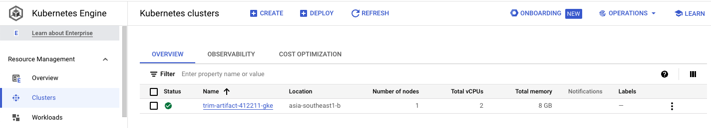

#### Run API in GKE cluster
- Connect to the cluster using `gcloud` command.
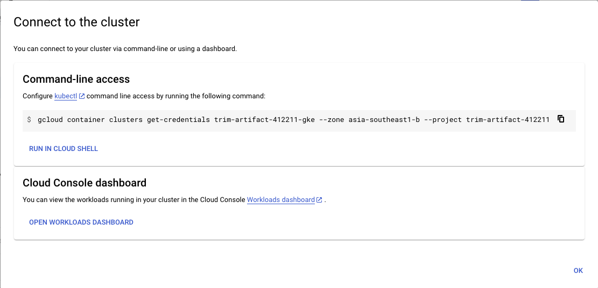

- Switch the current `context` using `kubectx`
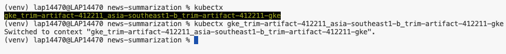

- Create namespaces
    ```
    kubectl create ns nginx-ingress
    kubectl create ns model-serving
    ```

- Deploy **NGINX-ingress**
    ```shell
    kubens nginx-system
    helm upgrade --install nginx-ingress helm-charts/nginx-ingress
    ```

- Get External IP of NGINX-ingress
    ```shell
    kubens nginx-system
    kubectl get svc
    ```
    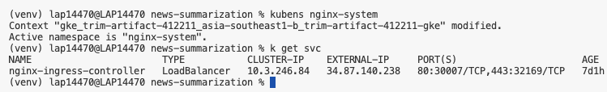

- Replace the External IP above in `spec/rules/host` in file `helm-charts/model-deployment/templates/nginx-ingress.yaml`

- Deploy Model
    ```
    kubens model-serving
    helm upgrade --install news-summarization helm-charts/model-deployment
    ```
- You can access the API in `NGINX_EXTERNAL_IP.nip.io/docs`
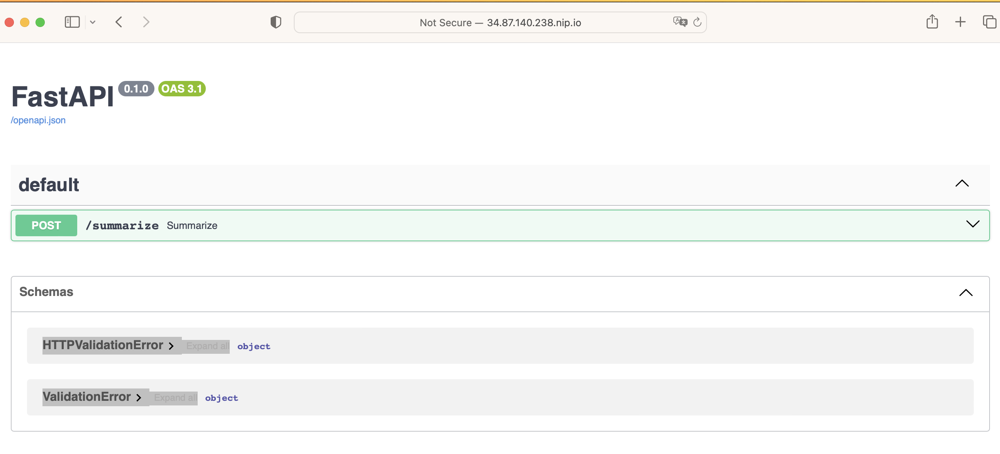

### CI/CD Jenkins in GCE

#### Create a Compute Instance using Ansible
- Create a new service account with [Compute Admin](https://cloud.google.com/compute/docs/access/iam#compute.admin) role. In this project, the service account is named `ansible-sa`.
- Navigate to **Service accounts** section, select action **Manage keys**.
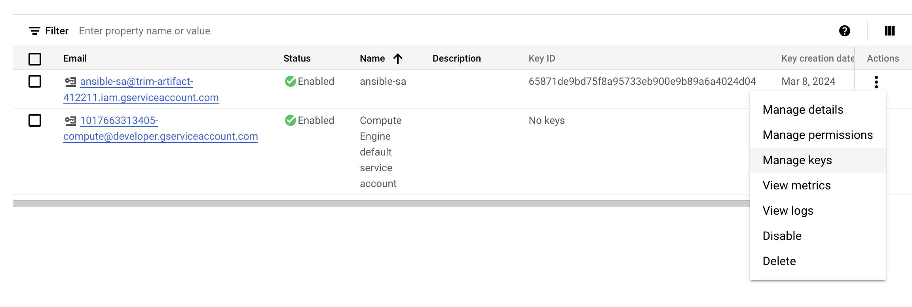

- Create new key of the created service account and download it as JSON file.


- Save the downloaded JSON key in `ansible/secrets`.
- Update the `service_account_file` field in `ansible/playbooks/create_compute_instance.yml` with your new path to the new JSON key.
- Run the following command in terminal to create a Compute Instance
    ``` shell
    ansible-playbook ansible/playbooks/create_compute_instance.yml
    ```
- After few moments, you should see your instance is successfully created with the name `vm-jenkins`
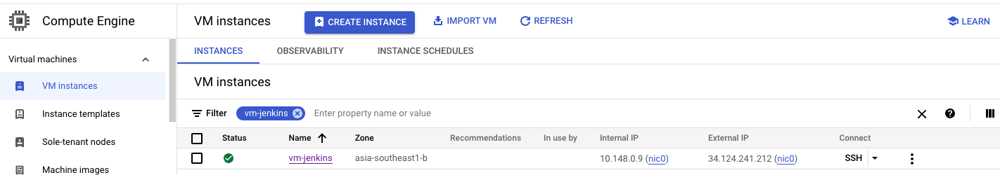

#### Deploy Jenkins on the Compute Instance
- Generate a new SSH key using `ssh-keygen` in the terminal of your local machine.
- Navigate to section **Settings/Metadata** and select tab **SSH KEYS**.
- Select **EDIT** and copy your public key that is just created (.pub file).
- Update the external IP of your VM and the path to private key in `ansible/inventory`.
- Run the following command in terminal to deploy Jenkins on the VM
    ```shell
    ansible-playbook --inventory-file ansible/inventory ansible/playbooks/deploy_jenkins.yml
    ```

#### Configure Jenkins
* **Connect to Jenkins UI**
  - Checking Jenkins installed successfully on GCE
    - Access the GCE instance
      ```
      ssh -i ~/.ssh/id_rsa YOUR_USERNAME@INSTANCE_EXTERNAL_IP
      ```
    - Verify if Jenkins is running in the Compute Engine instance
      ```
      sudo docker ps
      ```
  - Access Jenkins UI via `INSTANCE_EXTERNAL_IP:8081`.
  - Follow the instruction to log in into Jenkins.
  - The password can be retrieved by
    ```
    # inside GCE instance
    sudo docker exec -ti jenkins bash
    cat /var/jenkins_home/secrets/initialAdminPassword
    ```

* **Connect Jenkins to GitHub Repo**
  - Add Jenkins to Repo Webhook
    - Payload URL would `http://INSTANCE_EXTERNAL_IP:8081/github-webhook/`
    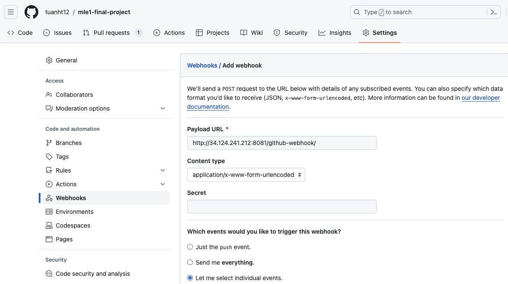

    - Event Trigger can be set to: *Pushes* and *Pull Requests*
  - Add GitHub Repo to Jenkins
    - Create new Multibranch Item in Jenkins
    - Create a new [Personal Access Token](https://github.com/settings/tokens]). In this project we will generate a **classic** token.
    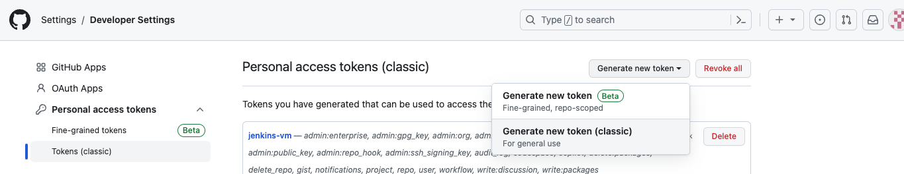
    - Connect Repo to Jenkins
        - Add credentials with your Github `username` and password is just-created `Personal Access Token`
        - Copy the URL to your Github repo.
        - Click `Validate` to see whether Jenkins successfully connect to your Github repo or not.
    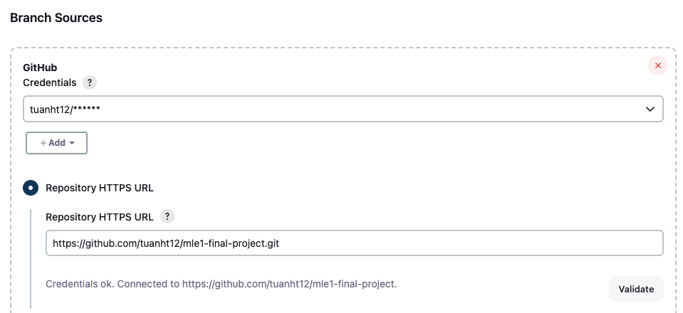

* **Add DockerHub Token to Jenkins Credential**
    - Create a new DockerHub Token
    - Add the token to Jenkins' Credentials
      - *Note*: ID must be `dockerhub` to match the `registryCredential` in `Jenkinsfile`.

* **Setup Cloud Connection**
  
  - Create `clusterrolebinding`
  ```
    kubectl create clusterrolebinding cluster-admin-binding --clusterrole=cluster-admin --user=system:anonymous
    kubectl create clusterrolebinding cluster-admin-default-binding --clusterrole=cluster-admin --user=system:serviceaccount:model-serving:default
  ```
  - Configure clouds at `http://INSTANCE_EXTERNAL_IP:8081/manage/configureClouds/`
    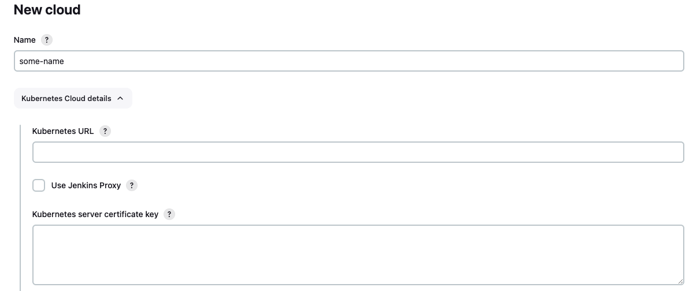 
    - Get `Kubernetes URL` and `Kubernetes server certificate key` by running the following in terminal of your local machine.
      ```
      cat ~/.kube/config
      ```
        - `Kubernetes URL` is `server`
        - `Kubernetes server certificate key` is `certificate-authority-data`

        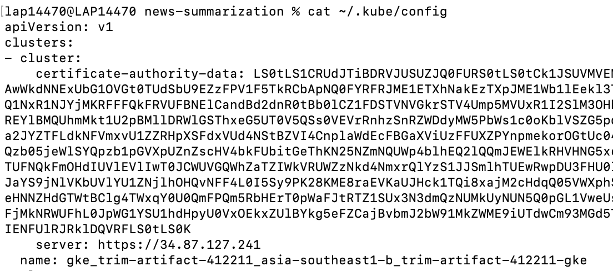
    
* **Build**
  - When there is a new push of new changes to a branch, the test pipeline will run.
  - When there are changes merged to `main`, the **Deploy** pipeline will run, build and push the latest image to DockerHub.
  - After that, the pipeline will use **Helm** to pull and deploy the latest image in GKE cluster automatically.
